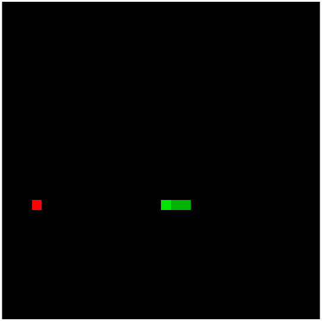
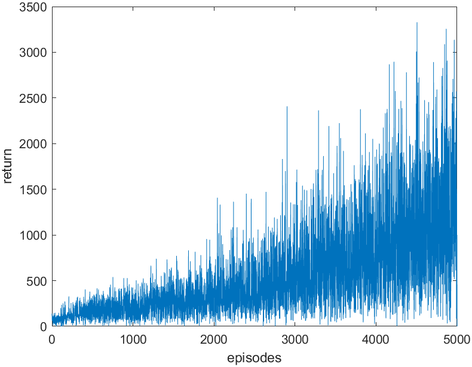

# Q-Learning Agent for Snake Based on Bellman’s Principle of Optimality (MATLAB)

Here's a MATLAB implementation of an AI agent applied to the classic game Snake. 

---

## 🎯 Aim of Q-Learning and Rules

The goal is to maximize the score (return) of the Snake through a single game, which means eating as many apples as possible. Both the snake and the apples appear in random positions. The game stops when the snake intersects itself or hits a wall. 

The learning process is based on the Bellman equation for Q-learning:

$$ Q(S_t, A_t) \leftarrow Q(S_t, A_t) + \alpha \left[ R_{t+1} + \gamma \max_a Q(S_{t+1}, a) - Q(S_t, A_t) \right] $$

This equation aims at maximizing the Q-function, which depends on States and Actions. 
* **States:** Represented by the relative position of the snake's head to the apple.
* **Actions:** The four possible directions the snake can choose to move.
* **Rewards:** The system gives negative rewards (penalties) when the agent dies and positive rewards when it reaches an apple.

The training session is expected to show an improving behavior over time. The figure below shows a typical learning curve.

---

## 🗂️ Code Structure

The project is structured around four main scripts and classes:

* `Learning.m`: Implements the Bellman equation and the training loop given the current state.
* `Snake.m`: A class that implements the agent's basic functionality, such as moving and recognizing possible states.
* `Board.m`: Implements the game board environment and provides the current state.
* `Game.m` / `GameUI.m`: Implements the base game either headless (without UI) or with the graphical User Interface.

---

## 🚀 How to Run

1. **Train the agent:** Run the script `Learning.m` to train the agent using the learning parameters provided in the property fields.
2. **Test the results:**
   * Run the script `Game.m` to evaluate the result over a fixed number of episodes without the UI.
   * Run the script `GameUI.m` to watch a single episode play out with the UI.
